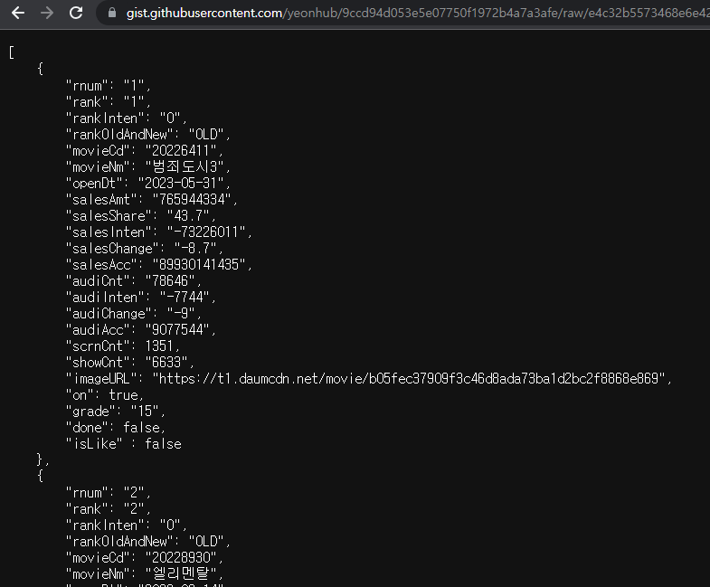
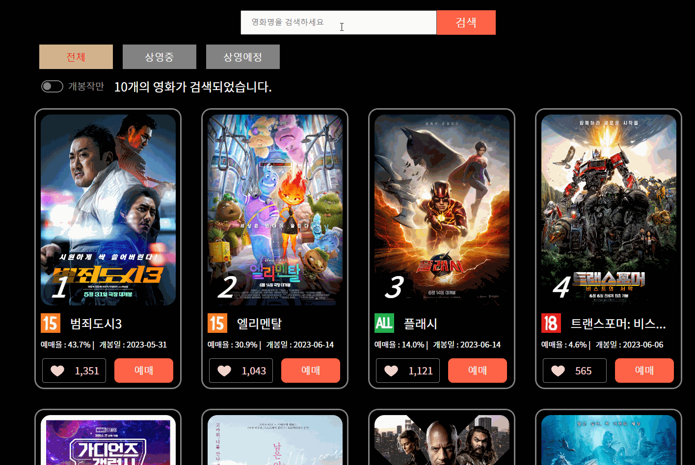
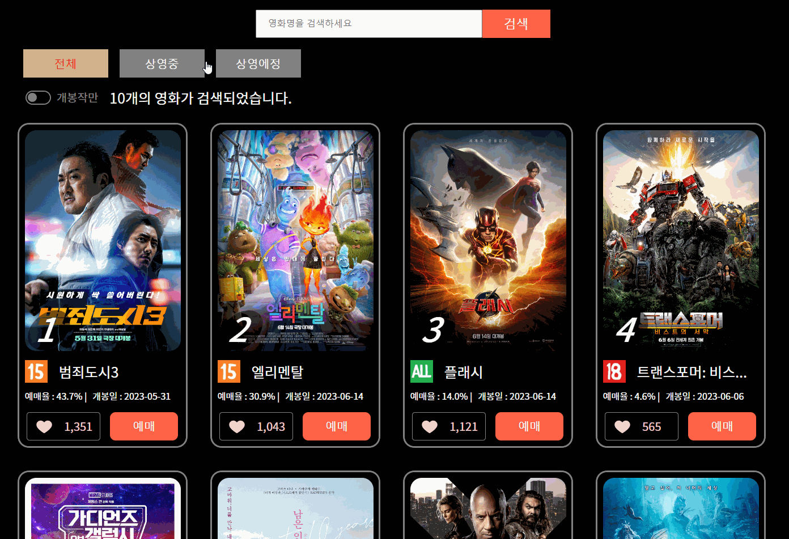
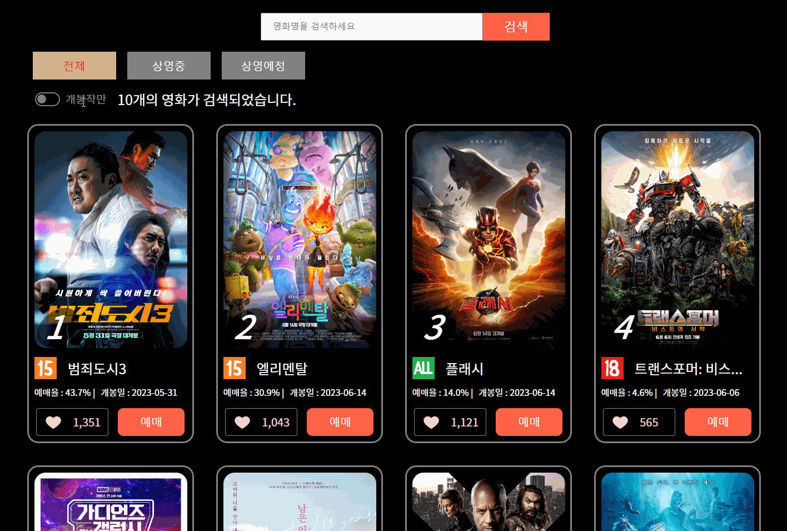
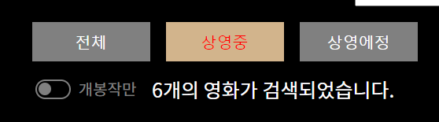

# AM-theater_api

## 페이지 캡쳐


## API JSON

github gist를 이용한 JSON 파일을 api로 받아 구현했다.


[movid(gist)](https://gist.github.com/yeonhub/9ccd94d053e5e07750f1972b4a7a3afe)



```json
[
    {
        "rnum": "1",
        "rank": "1",
        "rankInten": "0",
        "rankOldAndNew": "OLD",
        "movieCd": "20226411",
        "movieNm": "범죄도시3",
        "openDt": "2023-05-31",
        "salesAmt": "765944334",
        "salesShare": "43.7",
        "salesInten": "-73226011",
        "salesChange": "-8.7",
        "salesAcc": "89930141435",
        "audiCnt": "78646",
        "audiInten": "-7744",
        "audiChange": "-9",
        "audiAcc": "9077544",
        "scrnCnt": 1351,
        "showCnt": "6633",
        "imageURL": "https://t1.daumcdn.net/movie/b05fec37909f3c46d8ada73ba1d2bc2f8868e869",
        "on": true,
        "grade": "15",
        "done": false,
        "isLike" : false
    },
    {
        "rnum": "2",
        "rank": "2",
        "rankInten": "0",
        "rankOldAndNew": "OLD",
        "movieCd": "20228930",
        "movieNm": "엘리멘탈",
        "openDt": "2023-06-14",
        "salesAmt": "542744751",
        "salesShare": "30.9",
        "salesInten": "29552970",
        "salesChange": "5.8",
        "salesAcc": "6190129718",
        "audiCnt": "55730",
        "audiInten": "3330",
        "audiChange": "6.4",
        "audiAcc": "624167",
        "scrnCnt": 1043,
        "showCnt": "3864",
        "imageURL": "https://t1.daumcdn.net/movie/e4ce2c6ae33edb0ef32d5614b367f85c10a7316c",
        "on": true,
        "grade": "15",
        "done": false,
        "isLike" : false
    },
	.
	.
	.
```

```javascript
    const get = () => {
        const url = `https://gist.githubusercontent.com/yeonhub/9ccd94d053e5e07750f1972b4a7a3afe/raw/e4c32b5573468e6e42cc34123cbc436ea1fa7268/tem.json`

	// axios를 사용해서 data 가져오기

        axios.get(url)

	// 성공시 해당 data를 컴포넌트에서 사용할 data에 저장

            .then(res => {
                console.log(res.data);
                setData(res.data)
                setDataList(res.data)
                setLoading(true)
                setError(null)
            })

	// 실패시 data엔 빈 배열이 들어가고 error가 발생한다.

            .catch(error => {
                setData([])
                setLoading(false)
                setError('-- ERROR --')
            })
    }
  
	// 처음 한 번 data를 가져올 것이므로 useEffect 사용

    useEffect(() => {
        get();
    }, [])
```

## 기능 구현

<br>

### 1) 영화 검색 기능



```javascript
const Search = ({ changeInput, onSubmit }) => {
    return (

	// onSubmit을 추가해 form 안에서 enter를 입력해도 값이 전달되도록 했다.

        <form className='form' onSubmit={onSubmit}>

	// form 안의 input에 onChange(changeInput) 함수를 넣어
	// 검색어를 담아두는 변수 text에 할당한다.

	// (Main.jsx)
	// const changeInput = (e) => {
    // setText(e.target.value)
    // }

            <input className='input' type="text" onChange={changeInput} placeholder='영화명을 검색하세요' />
            <button className='btn' type='submit'>검색</button>
        </form>
    );
};
```

```javascript
    const onSubmit = (e) => {

	// 새로고침 방지를 위해 preventDefault()
	// 검색어(text)를 입력하지 않았을 경우 그대로 return
	// 입력했을 경우 onSearch 함수에 text를 매개변수로 전달 후 실행

        e.preventDefault();
        if(!text) return
        setText('')
        onSearch(text)
    }
```

<br>

### 2) 상영중 / 상영예정 버튼



```javascript
const On = ({ onShow, data ,changeChk,on}) => {
    return (
        <div className='on'>
            <p className='type'>

	// 현재 출력중인 영화 상태(상영/상영예정)에 따라 버튼 class에 onbtn을 넣어준다.
	// 버튼 클릭시 onShow함수를 호출하며 두 가지 매개변수를 넘겨준다.

                <button className={on==='all'?'onbtn':''} onClick={() => onShow('all','')}>전체</button>
                <button className={on==='true'?'onbtn':''} onClick={() => onShow(true,'true')}>상영중</button>
                <button className={on==='false'?'onbtn':''} onClick={() => onShow(false,'false')}>상영에정</button>
            </p>
            <p className='onNow'>
                <input role="switch" type="checkbox" onChange={changeChk}/>
                <span>개봉작만</span>
                <em>{data.length}개의 영화가 검색되었습니다.</em>
            </p>
        </div>
    );
};
```

```javascript
    const onShow = (on, bul) => {

	// 전체 버튼 클릭 시 axios.get을 실행하는 함수가 호출 되고
	// onbtn class가 붙을 버튼은 all

        if (on === 'all') {
            get()
            setOn('all')
        } else {

	// 상영중 버튼은 true, 상영예정 버튼은 false의 불린값을 매개변수로 전달해 주므로
	// data에서 상영중/상영예정을 구별하는 키 값인 on과 비교해 일치하는 객체만 filter한다.

            setOn(bul)
            setData(dataList.filter(item => item.on === on))
        }
    }
```

<br>

### 3) 개봉작만 (checkbox) 버튼



```javascript
            <p className='onNow'>
                <input role="switch" type="checkbox" onChange={changeChk}/>
                <span>개봉작만</span>
                <em>{data.length}개의 영화가 검색되었습니다.</em>
            </p>
```

```scss
.onlyOn {

	// checkbox의 style을 변경하기 위해 기존의 checkbox는 
	// appearance: none로 style을 제거했다.

        font-size: 20px;
        margin-right: 10px;
        appearance: none;
        position: relative;
        border: max(2px, 0.1em) solid gray;
        border-radius: 1.25em;
        width: 2.25em;
        height: 1.25em;
        vertical-align: middle;
  
        &::before {
          content: "";
          position: absolute;
          left: 0;
          width: 1em;
          height: 1em;
          border-radius: 50%;
          transform: scale(0.8);
          background-color: gray;
          transition: left 250ms linear;
        }
  
        &:checked {
          background-color: tomato;
          border-color: tomato;
  
          &::before {
            background-color: white;
            left: 1em;
          }
        }
      }
```

```javascript
    const changeChk = (e) => {
        setIsChk(e.target.checked)

	// 상영작만 checkbox가 check되었을 경우 개봉작과 마찬가지로 
	// on의 value가 true인 객체만 filter
	// 그리고 상영중 버튼에 onbtn class를 추가해 주는 setOn

        if (!isChk) {
            setData(dataList.filter(item => item.on === true))
            setOn('true')
        } else {
            setData(dataList.filter(item => item.on === false))
            setOn('false')
        }
    }
```

<br>

### 4) 검색된 영화 수 표시



```javascript
            <p className='onNow'>
                <input className='onlyOn' role="switch" type="checkbox" onChange={changeChk}/>
                <span>개봉작만</span>

	// 상영 / 상영예정 버튼 클릭, 개봉작만 checkbox 모두 setData를 사용하므로
	// 출력되는 영화의 수를 나타내기 위해 data.length를 사용했다.

                <em>{data.length}개의 영화가 검색되었습니다.</em>
            </p>
```
